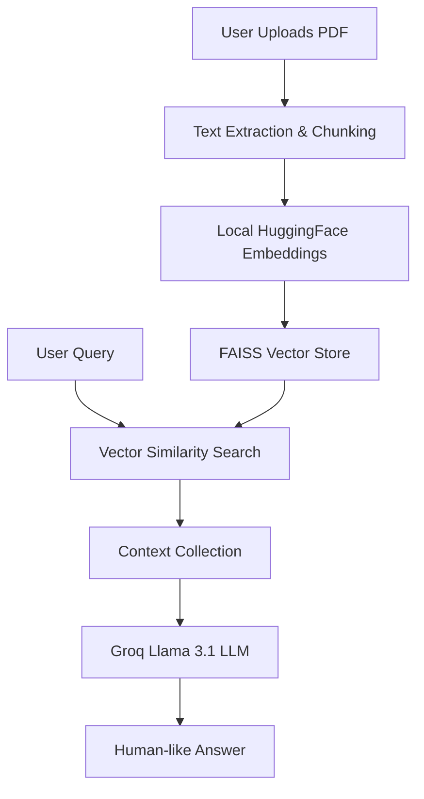

# DocGenius: PDFQuery AI - Powered by Groq 📄🚀

**DocGenius (PDFQuery AI)** is a high-performance, RAG-based (Retrieval-Augmented Generation) document assistant that allows you to chat with your PDFs in real-time. By leveraging the ultra-fast **Groq API** and privacy-first **Local HuggingFace Embeddings**, you get instant, accurate answers without the overhead of heavy cloud API costs or latency.

## 🌟 Key Features

- **⚡ Blazing Fast Responses**: Uses the Groq Llama 3.1 model for near-instant inference.
- **🧠 Intelligent PDF Chat**: Upload any PDF and ask questions in natural language.
- **🛡️ Privacy-First Embeddings**: Text chunking and vectorization are handled locally using `all-MiniLM-L6-v2`.
- **✍️ AI Content Generator**: A dedicated page for brainstorming and generating insights using AI.
- **🎨 Custom UI/UX**: Professional layout with **Light/Dark mode** support and a clean, branding-focused design.
- **🐳 Production Ready**: Optimized for Streamlit Cloud deployment with built-in secret management.

## 🏗️ High-Level Design (HLD)

The application follows a standard **RAG (Retrieval-Augmented Generation)** architecture:



## 🛠️ Tech Stack

- **Framework**: [Streamlit](https://streamlit.io/)
- **LLM Engine**: [Groq Cloud](https://console.groq.com/) (Llama-3.1-8b-instant)
- **Orchestration**: [LangChain](https://www.langchain.com/)
- **Embeddings**: [HuggingFace](https://huggingface.co/) (`all-MiniLM-L6-v2`)
- **Vector Database**: [FAISS](https://github.com/facebookresearch/faiss)
- **PDF Processing**: [PyPDF2](https://pypdf2.readthedocs.io/)

## 🚀 Getting Started

### 1. Installation

```bash
# Clone the repository
git clone https://github.com/anshika-75/PDFQuery-AI.git
cd PDFQuery-AI

# Create a virtual environment
python -m venv .venv
source .venv/bin/activate  # On Windows: .venv\Scripts\activate

# Install dependencies
pip install -r requirements.txt
```

### 2. Configuration

Create a `.env` file in the root directory (or use `.env.example`):

```bash
GROQ_API_KEY=your_groq_api_key_here
```

> **Note**: For Streamlit Cloud deployment, add the key in the **Secrets** dashboard as `GROQ_API_KEY`.

### 3. Run the App

```bash
streamlit run app.py
```

## 📂 Project Structure

```text
├── PDFQueryAI/
│   └── PDFQuery.py      # Core RAG logic and PDF processing
├── .streamlit/
│   └── config.toml      # Streamlit UI configuration
├── assets/              # App logos and images
├── app.py               # Main Streamlit application
├── requirements.txt     # Project dependencies
└── .env                 # API Keys (gitignored)
```

## 🤝 Contributing

Contributions are welcome! If you have suggestions for improvements or new features:
1. Fork the Project.
2. Create your Feature Branch (`git checkout -b feature/AmazingFeature`).
3. Commit your Changes (`git commit -m 'Add some AmazingFeature'`).
4. Push to the Branch (`git push origin feature/AmazingFeature`).
5. Open a Pull Request.

## 📄 License

Distributed under the GNU General Public License v3.0. See `LICENSE` for more information.

---
Developed with 💜 by **Anshika**
